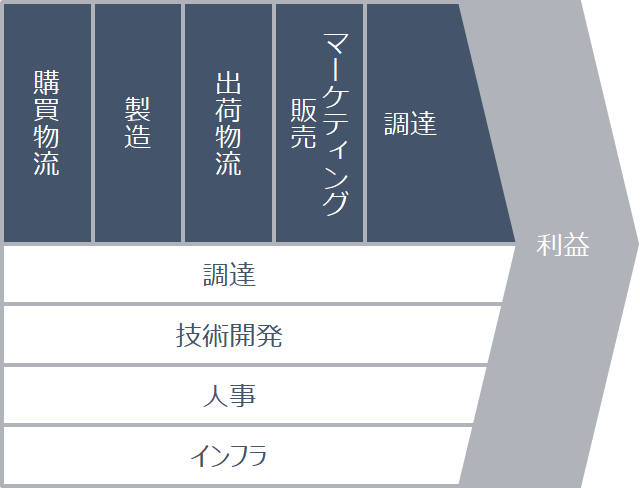
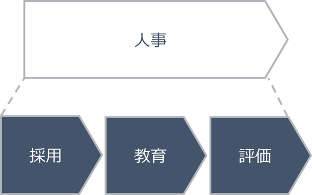

# HRについて
基本的なビジネスプロセスの説明

---
## HR(Human Resources)
### 人事のこと

### HRのミッションをこう考える

### HRの手法をこう考える
採用、教育、評価をもってミッションを果たす  
バラバラにやってもダメ

---
## バリューチェーン上のポジション
### HRは支援活動
土台、屋台骨、大切！  
HR = 活動 ≠ 人事部  
e.g.日本では人事部が採用、海外では営業部が営業員を採用

---
## プライマリ・プロセス

---
## プロセスグループ

---
## プロセス
